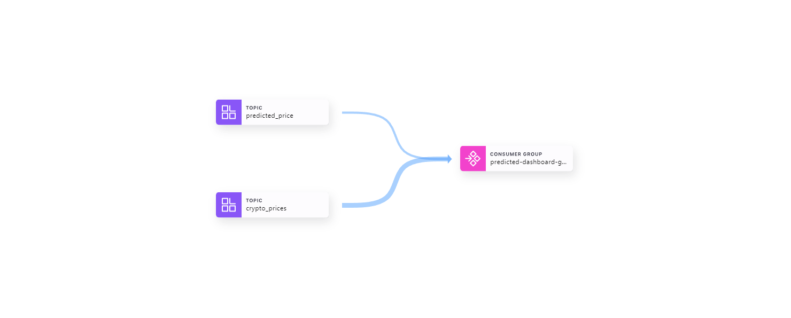
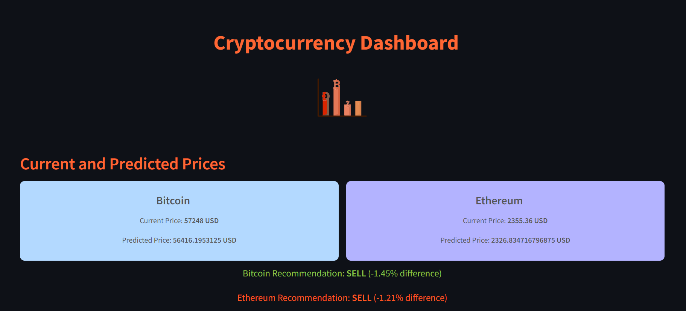
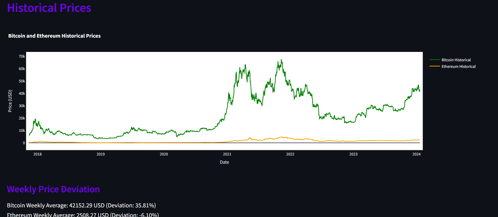

# Cryptocurrency Price Prediction Dashboard

This project is a **real-time cryptocurrency price prediction dashboard** using Apache Kafka, machine learning models, and Confluent Cloud. The dashboard displays real-time and predicted prices for **Bitcoin** and **Ethereum** along with buy/sell recommendations, historical trends, and price deviation analysis.

## Features
- **Real-time Cryptocurrency Prices**: Fetches the latest Bitcoin and Ethereum prices from the CoinGecko API.
- **Machine Learning Predictions**: Predicts the future prices of Bitcoin and Ethereum using pre-trained ML models.
- **Buy/Sell Recommendations**: Based on predicted vs current prices.
- **Historical Data Visualization**: Displays trends in cryptocurrency prices over time.
- **Price Deviation Analysis**: Shows weekly price deviation for Bitcoin and Ethereum.

## Architecture



### Components:
- **Producer**: Fetches real-time cryptocurrency prices and sends them to the Kafka topic `crypto_prices`.
- **Consumer/ML Processor**: Receives real-time prices, predicts future prices using ML models, and sends the predictions to the `predicted_price` Kafka topic.
- **Dashboard**: Visualizes real-time and predicted data, historical prices, and buy/sell recommendations.

## Files
- `kafka_crypto_producer.py`: Sends real-time cryptocurrency prices to Kafka.
- `kafka_crypto_consumer.py`: Consumes real-time prices, predicts future prices, and sends predictions to Kafka.
- `streamlit_dashboard.py`: The Streamlit-based dashboard that fetches real-time and predicted data from Kafka, displaying prices and recommendations.
- **Assets**: 
  - `recording.webm`: A video recording of the working dashboard.
  - `d1.png`, `d2.png`: Screenshots of the dashboard.
  - `cluster_lineage.png`: A diagram showing the Kafka data pipelines using Confluent Cloud.

## Setup Instructions

### Prerequisites:
- Python 3.x
- Confluent Cloud account
- Kafka Python client (`confluent_kafka`)
- Streamlit
- TensorFlow/Keras for loading the ML models

### Installation
1. Clone the repository.
   ```bash
   git clone https://github.com/your-repo/crypto-dashboard.git
   ```
2. Install required dependencies.
   ```bash
   pip install -r requirements.txt
   ```

3. Configure your Kafka settings in the producer and consumer scripts:
   - `kafka_crypto_producer.py`
   - `kafka_crypto_consumer.py`

### Add Your Kafka Bootstrap Server, API Key, and Secret
You must configure the **bootstrap server URL**, **API key**, and **secret** for your Kafka cluster in both the producer and consumer scripts.

1. Open `kafka_crypto_producer.py` and `kafka_crypto_consumer.py`.
2. Locate the following configuration fields in both files:

```python
'bootstrap.servers': '<YOUR_BOOTSTRAP_SERVER>',
'sasl.username': '<YOUR_API_KEY>',
'sasl.password': '<YOUR_SECRET>',
```

3. Replace `<YOUR_BOOTSTRAP_SERVER>`, `<YOUR_API_KEY>`, and `<YOUR_SECRET>` with the details from your Confluent Cloud account.

4. Add your pre-trained ML models for Bitcoin and Ethereum predictions:
   - `bitcoin_prediction_model.h5`
   - `ethereum_prediction_model.h5`

### Running the Project

1. **Start the Kafka producer** to fetch real-time prices and send them to Kafka:
   ```bash
   python kafka_crypto_producer.py
   ```

2. **Run the Kafka consumer** to predict cryptocurrency prices:
   ```bash
   python kafka_crypto_consumer.py
   ```

3. **Launch the Streamlit dashboard**:
   ```bash
   streamlit run streamlit_dashboard.py
   ```

4. Open the dashboard in your browser at `http://localhost:8501`.

## Screenshots
- Dashboard Overview:
  
  
- Historical Data and Predictions:
  

## Video Demonstration
- Watch the [dashboard in action](recording.mp4).

## Future Enhancements
- Implement additional cryptocurrency models.
- Improve the anomaly detection system.
- Add more advanced visualizations for user interaction.

